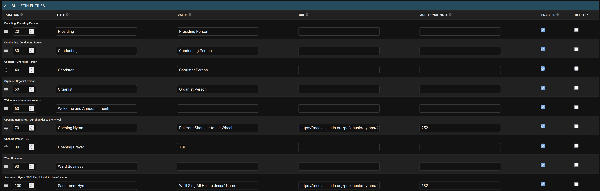

# Ward Bulletin

A ward bulletin website with a Django backend and custom admin application for easy management. Fully customize the page to meet your needs without touching any code.




#### Table of Contents
- [Users](#users)
    - [Quick Start](#quick-start)
- [Web Administrators](#web-administrators)
    - [Requirements for Hosting](#requirements-for-hosting)
    - [Deploying](#deploying)
- [Developers](#developers)
    - [Configuration](#configuration)
    - [Tailwind CSS](#tailwind)

---
## Users

Once the webpage has been configured and is up and running, use this guide to configure the page content. This guide assumes you have an active admin account and can access the Django admin interface at your configured admin URL.

### Quick start:

1. Create and configure the **General Settings** table
1. Create and configure the **Meeting Times** table
1. Review the enabled quotes in the **Quotes** table
1. Open the **Bulletin Groups** table
    1. Add a new Bulletin Group
    1. Name the group, enable it, and add bulletin entries corresponding to what you want displayed on the homepage
1. Create additional bulletin groups for different meeting schedules, but make sure only one group is enabled at a time
    - You can duplicate a group by opening an existing group and clicking the **Save as new** button so you don't need to start from scratch each time
1. Open the **Announcements** table
    1. Add a new announcement
        - The announcement content box supports Markdown and HTML (See [USERS.md](USERS.md) for more details if you are unfamiliar with these formats)
    1. You can add all your announcements in a single announcement entry, or split them up into multiple sections and they will all be displayed in the order specified
1. Open the **Contact Tables** table
    1. Create a new Contact Table
        1. In the **ALL Contacts** section of the form, add your contacts
        2. If you would rather create a custom table, you can use Markdown or HTML in the **Raw content** field
1. The **All Contacts** table and the **All Bulletin Entries** table each contain the combined list of entries from each individual **Contact Table** or **Bulletin Group**. You likely will not need to access these tables directly, and your site administrator may hide these tables from your view. 
1. The **Active Bulletin Entries** table will contain all the bulletin entries for whichever **Bulletin Group** is currently enabled. This is a convenient table for quickly editing an entry. For example, if a quick edit needs to be made to the bulletin Sunday Morning, the entries in this table are easy to edit from a phone

For more detailed instructions, please see [USERS.md](USERS.md)

---
## Web Administrators

### Requirements for hosting
- MySQL Server
- Python application support with a recent version of Python. I don't know the minimum required version but Python 3.9+ will work for sure. I expect most Python 3 versions will be fine. 

### Deploying
Here is an outline of the steps needed to get the website deployed. You will likely need to adjust the steps based on your exact environment.

1. Make sure you have your domain and hosting purchased and configured. This is outside the scope of this project, but if you have any questions about how I set my site up, feel free to ask on the discussions page
1. Download the latest release of the repository
1. Copy the code to your webserver
    - These two steps can be combined if you are able to clone the repository directly to the server. That will also make it easy to pull updates from the repository when needed
1. Make sure you have configured a Python application on your server if it is running CPanel (other server setups might vary)
1. Install pipenv with `pip install -r requirements-deploy.txt`
1. Install the dependencies with `pipenv install`
1. Create a `.env` file based on the `.env.example` file provided, making sure to fill in the correct details for your database
1. If you are running the wsgi appliation yourself, it might look something like this:
    - `gunicorn --bind :8000 wardbulletin.wsgi.prod:application`
    - If you are using a webhost, they likely will handle this for you, just follow their guide on running a Python application
1. In the wardBulletin directory, run:
    - `python manage.py makemigrations` - Prepares any missing migrations
    - `python manage.py migrate` - Creates the database configuration
    - `python manage.py createsuperuser` - Creates an admin user account
1. Upload a logo to `wardbulletin/main/static/main/images/logos` if you want a logo in the top-left corner of the page
1. Modify or replace the folder of temple photos at `wardbulletin/main/static/main/images/temples` as you see fit
1. Import the quote_data.json file into the quote table (unless you plan on using your own quotes)
    - `python manage.py loaddata ../quote_data.json`
1. In the root of the folder, run `./tailwindcss -i wardbulletin/main/static/main/source.css -o wardbulletin/main/static/main/dist.css --minify`
1. In the wardBulletin directory, run:
    - `python manage.py collectstatic` - Collects the static files for Django
    - `python manage.py check --deploy`, and take care of any issues reported
1. Log into the admin interface at your chosen admin URL in the `.env` file
1. You don't need to expose all the tables to your bulletin editors - I recommend creating a permissions group and settings permissions for just the tables they need to access
1. Create user accounts for anybody who needs access to the admin interface, and assign permissions as needed
    - See [here](https://developer.mozilla.org/en-US/docs/Learn/Server-side/Django/Authentication#creating_users_and_groups) for instructions on managing users and groups in Django
1. Go through the tables and set up your initial data as desired, or leave this to the bulletin editors

Congratulations! You should now have a fully configured ward bulletin website for your ward.


---
## Developers

If you are interested in contributing or want to modify the project for your own purposes, here are some notes to get you started.

### Configuration

A docker-compose environment is included, so you can test the website easily. Clone the code, install the developer dependencies with `pip install -r requirements-developer.txt`, then run `docker-compose build` and `docker-compose up` to start the local instance.

Once the images are running, open the `wardbulletin-djangoapp` image shell and run:
```bash
python manage.py makemigrations
python manage.py migrate
python manage.py createsuperuser
```

To add new dependencies, add them to `Pipfile`, then either rebuild the image, or open the image shell and run `pipenv lock` and `pipenv install --system` to install them.

If you are able to host a docker instance for production use, remove the `docker-compose.override.yml` file so docker uses the production Dockerfile instead of the developer version. 

### Tailwind

Use the following commands to manage the tailwind css files

```bash
./tailwindcss -i wardbulletin/main/static/main/source.css -o wardbulletin/main/static/main/dist.css --watch # Have this running while editing the code
./tailwindcss -i wardbulletin/main/static/main/source.css -o wardbulletin/main/static/main/dist.css --minify
```

If you add any new css classes that follow the color theme, like `bg-{{ color }}-500` or whatever, make sure you update the enumerated set of classes at the bottom of `wardbulletin/main/templates/main/base.html`. This will allow the `tailwindcss` script to pick up the needed styles and include them in the `dist.css` file.