# Detailed User Guide

This document will go into more details on each table in the admin interface. 

#### Table of Contents
- [General Settings](#general-settings)
- [Quotes](#quotes)
- [Bulletin Groups](#bulletin-groups)
- [Active Bulletin Entries](#active-bulletin-entries)
- [Class Schedules](#class-schedules)
- [Announcements](#announcements)
- [Contact Tables](#contact-tables)

---
## General Settings

On a brand new database setup, you will need to create the General Settings table. Click the `Add` Button to the right of the table name to create the table. If the table is already created, click `Change` or `General Settings` instead. This will open the form editor where you can configure your general settings:

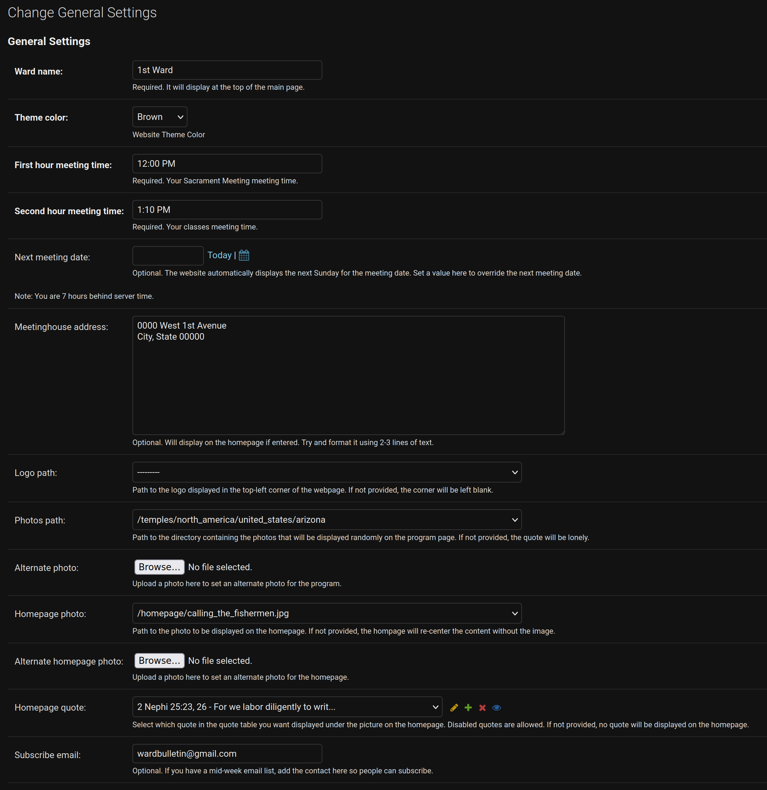

- Ward name
	- Set your Ward name here. It will be displayed at the top of the home page
- Theme color
	- Choose a theme color
	- The first six colors are all neutral and probably safe choices
- First hour meeting time
	- Will show up above your program
- Second hour meeting time
	- Will show up under your program, above your class schedule (if you include one)
- Next meeting date
	- If you leave this blank, the webpage will automatically display the upcoming Sunday as your next meeting date
	- If for any reason you want to override this date, you can put date here and it will display on the webpage instead, as long as the date you choose is later than the current date
- Meetinghouse address
	- If you include an address, it will show up on the homepage with a hyperlink that should open it in Apple or Google maps when clicked
- Logo path
	- If you uploaded a logo to the correct location, it should be visible in this list
	- There is a default logo that matches the page theme included if you don't have a logo
- Photos path
	- This dropdown will list every photo and file in the images area of the project. If the contents weren't modified, if will contain pictures of most of the temples organized by location
	- You can select any level of the folder hierarchy you want and the webpage will randomly display photos from within the selected hierarchy. So `/temples` will shuffle all the photos, while `/temples/north_america/united_states` will shuffle all the United States photos.
- Alternate photo
	- If you want to upload your own photo and override the randomly selected photos, you can use this field to do so
	- It will only allow you to upload a single photo, but it will take priority over the random photos, so you can use it to set a custom photo each week
- Homepage photo
	- Select the photo that will be displayed on the homepage
	- A single photo has been included as an example and a default option
- Alternate homepage photo
	- Like `Alternate photo`, you can override the default homepage photo with this field without needing to have your web administrator upload files to the webserver
- Homepage quote
	- Select the quote that will be displayed on the homepage
	- Any of the quotes in the Quotes table are available, even the disabled ones
	- `2 Nephi 25: 23, 26` is a nice choice
- Subscribe email
	- If your ward has a mid-week email that members can subscribe to, you can enter the email address here, and it will add an entry to the homepage with a link that drafts an email to this address requesting the subscription

---
## Quotes

A list of quotes that will randomly be displayed on your webpage next to the random temple image and above the program. If you delete or disable all the quotes, the temple photo will display by itself. If you don't select any photos in **General Settings**, the quote will display by itself. You can disable both if you want the page to go straight to the program.

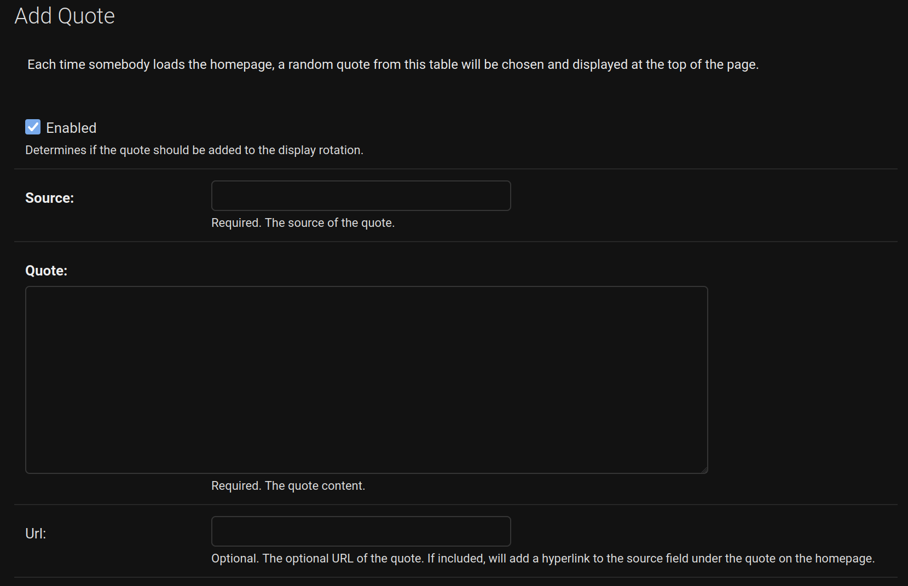

To add a new quote, fill out the **Add Quote** form. You need to specify the source of the quote and the quote itself. You can optionally add a link to the source, which will hyperlink the source when it displays on the webpage.

---
## Bulletin Groups

Think of each Bulletin Group as a different Sunday program. Each can contain a distinct list of entries that will display on the webpage when the group is enabled. There are multiple strategies for managing bulleting groups:

- Maintain a single table that you modify each week
- Maintain a handful of "template" tables that you clone each week and modify as needed
	- A template for regular sundays
	- A template for fast sundays
	- Any other configurations you want as a template
- Each week, add the meeting date to the group name and make a new clone of the group so you have a rolling history of previous programs

You will want to figure out what works best for you. The system is flexible enough to support multiple strategies. 

While managing bulletin entries within a group, they will be displayed in a table like this:

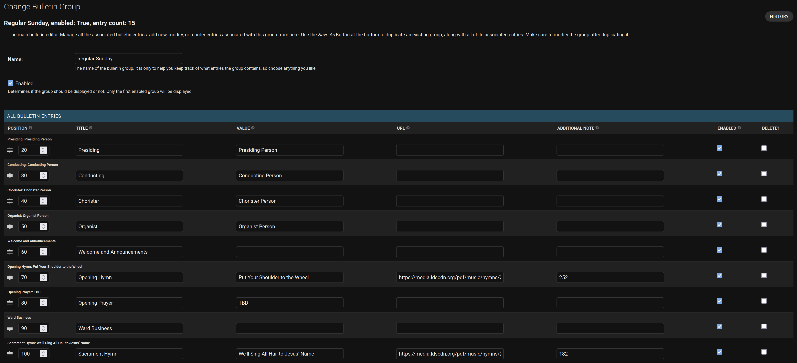

You will need to scroll horizontally to access the full row if your screen is too narrow. The bulletin entries can be dragged and dropped to rearrange them. When adding new entries either in the bulletin group table, or separately in the **Active Bulletin Entries** view, you will see the following fields:

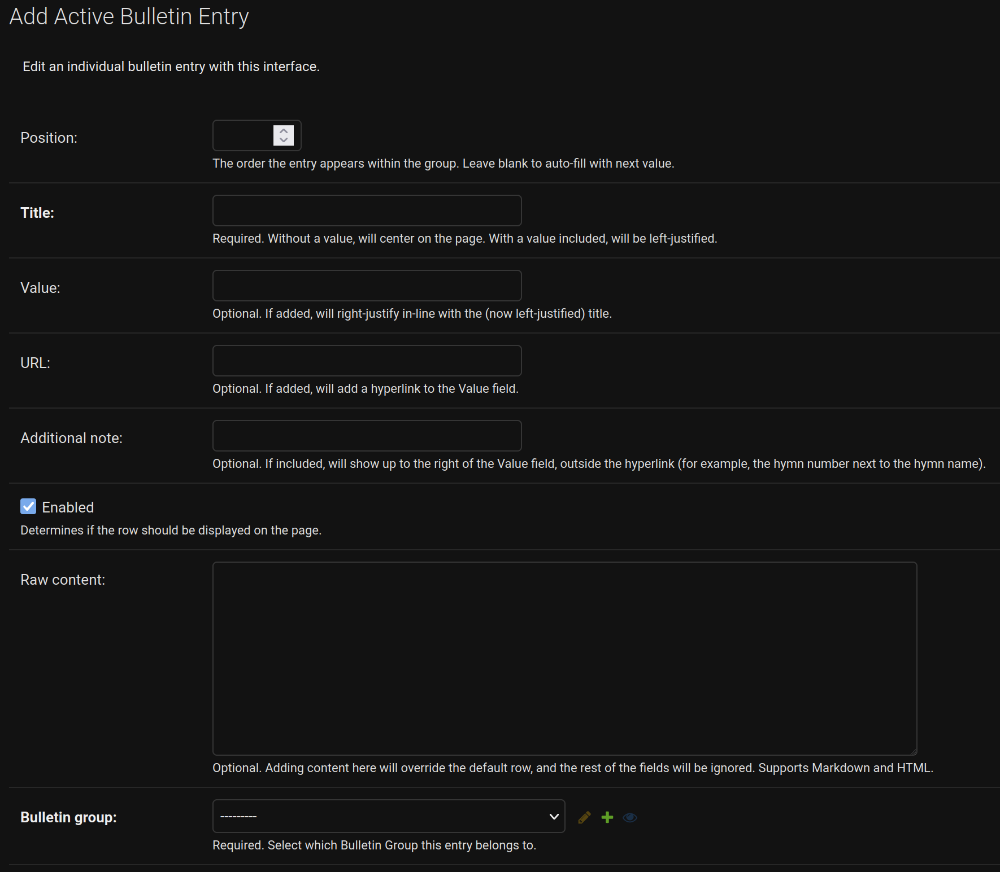

- Position
	- The order of the entry on the page. If you drag and drop to rearrange the table, this value will update automatically
- Title
	- The main text of the entry row
		- you have to enter at least a title
	- If you don't put anything else in the row, the text will be centered on the page
	- If you add a value, it will push this text to the left edge of the page
- Value
	- If you add text to this field, it will push the title text to the left edge of the page and this will be placed on the right edge of the page
- URL
	- If you add a URL, it will create a hyperlink on the **Value** text on the page
	- This is useful for linking directly to hymn PDFs or class lessons on the Church website
- Additional Note
	- If you want additional text displayed outside the hyperlink, you can add it here
	- On the page, it will look like: "[Value]() | Additional Note"
	- You can use this even if you don't include a URL
	- This is useful for the hymn number or the classroom location for a class
- Enabled
	- If the row is disabled, it will not show up on the page
	- You can use this to toggle a few common rows on or off as needed without creating an entirely new group
- Raw content
	- If for whatever reason you want the bulletin row to look different, you can use this field
	- Raw content supports Markdown and HTML formatting, so you can fully customize the contents of the row
	- Make sure you verify your results after adding something to this field - it can potentially break the layout of the page if you get too creative with it
	- See [Announcements](#announcements) for more details on Markdown and HTML formatting
- Bulletin Group
	- If you are creating the entries within a Bulletin Group, you will not see this field
	- If you are creating the entries within the **Active Bulletin Entries** table, you can use this field to assign the entry to a particular Bulletin Group

Here is an example of five bulletin entries:

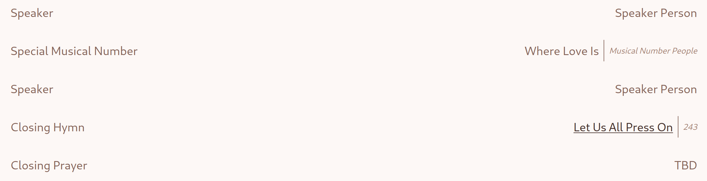

The Special Musical Number and the Closing Hymn entries are using the **Additional Note** field, and the Closing Hymn includes a URL for the hymn. Here is how those entries look in the bulletin group table:

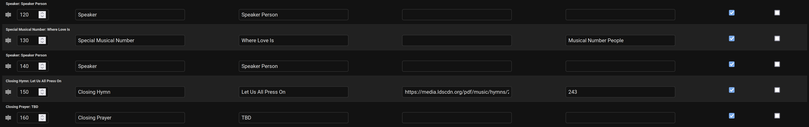

After creating a bulletin group, one of the "save" buttons will be called "save as new". This button can be used to duplicate a group and all of its entries. Just keep an eye on which group you have enabled!

---
## Active Bulletin Entries

This is a table of bulletin entries filtered to show only the entries associated with whichever **Bulletin Groups** are enabled. If you keep the enabled Bulleting Groups to a single group, it will display just the rows of that table. This is a convenient table for editing from a phone, because you don't need to worry about the table view and scrolling left/right. You can open an individual entry and edit with a nice, mobile-friendly form&mdash;just click the hyperlinked title field in the table. 

This is convenient because you might need to make quick changes Sunday morning, so being able to open this table with your phone and make the change makes that an easy task.

---
## Class Schedules

The **Class Schedules** table contains a list of class schedule groups. Each enabled group will show up on the program in the *Second Hour* block, below the main program.

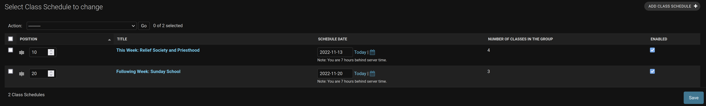

The schedules will display in the order specified.

Each class schedule has a title and a schedule date. The title will be displayed above the list of classes on the page, and if a date is included, it will show as a second row under the title. 

The class entries within the class schedule follow the same format and rules as the bulletin group entries. See [Bulletin Groups](#bulletin-groups) for more information.

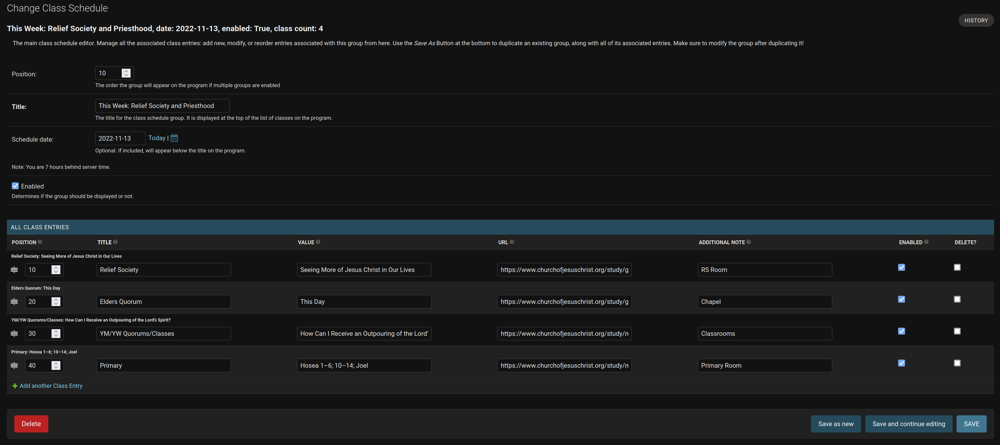

Here is what the resulting program page looks like with both schedules displayed:

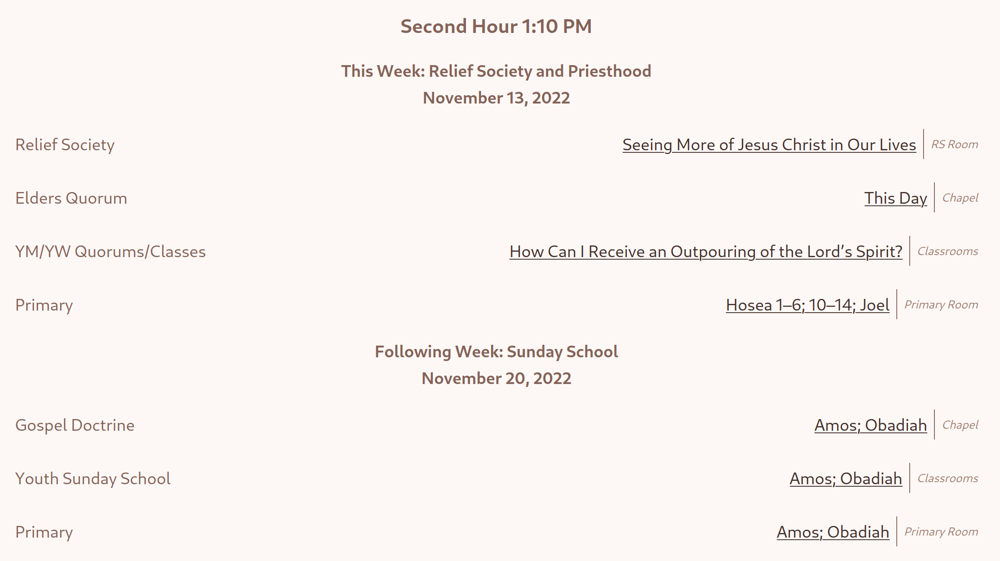

---
## Announcements

The **Announcements** table allows you to manage announcement entries for the announcements page of the website. You can either create a single announcement entry in the table that contains everything you want on the webpage, or break it up into individual sections that will get ordered how you specify. Each entry can be individually enabled. 

The announcement content block supports formatting with Markdown and HTML. There are many online editors for both of these formats that make it easy to create nice looking announcements 
- For Markdown, try an editor like [this one](https://markdown-editor.github.io/). You can use the formatting tools to style your text on the left side and see a preview of how it will look on the right side, then copy the formatted text on the left side into the announcement content box
- For HTML, try a "[WYSIWYG](https://en.wikipedia.org/wiki/WYSIWYG)" editor like [this one](https://html-online.github.io/). Format your announcement however you want, then select the `View -> Source Code` menu option and copy all the source code into the announcement content box

These options will let you fully customize how your announcement page is displayed. You can use a mix of either option. You could have a separate entry for each auxiliary and let somebody from each group manage the announcement section for themselves, or have a single person handle getting the announcments formatted and in place. You will want to figure out a method that works for you. 

Note: Keep an eye on the consistency of your markdown header sizes between entries. I found ### to be a good starting header size for individual announcement entries. Additionally, you might want to stick a page header such as `<h1 style="text-align:center">Ward Announcements</h1>` at the top of your first announcmenet (or make it its own announcement), to introduce the page properly.

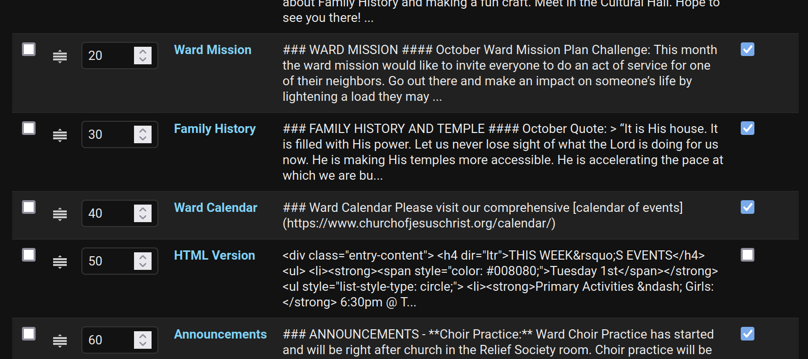

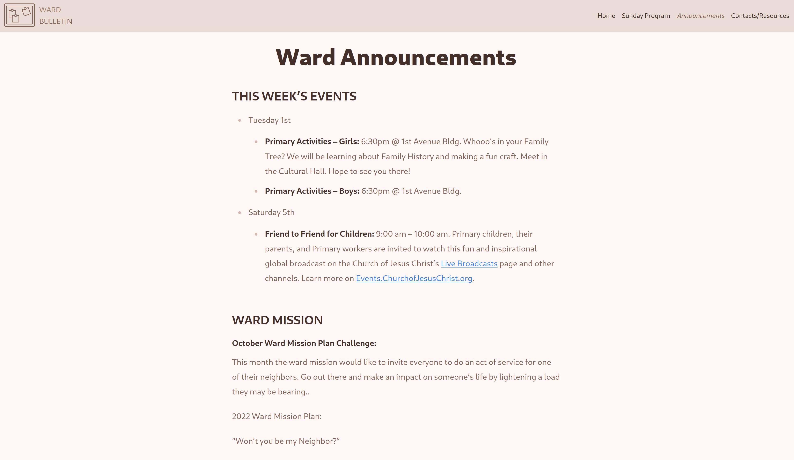

---
## Contact Tables

Each enabled contact table you create will be displayed on the **Contacts/Resources** page on the website. The default table format includes the individual's name, calling, email address, and phone number (the email address will be a hyperlink on their name). The name and calling are required, but the phone number and email address are optional, although skipping both would make me question the benefit of including the individual in the table. That being said, don't put anybody's contact information on this page without getting their permission first, since it is on the internet without any security so anybody can access the page and see the information. Our ward chose to set up a dedicated email address for each auxiliary with an associated Google Voice number. These are what we included on our page. 

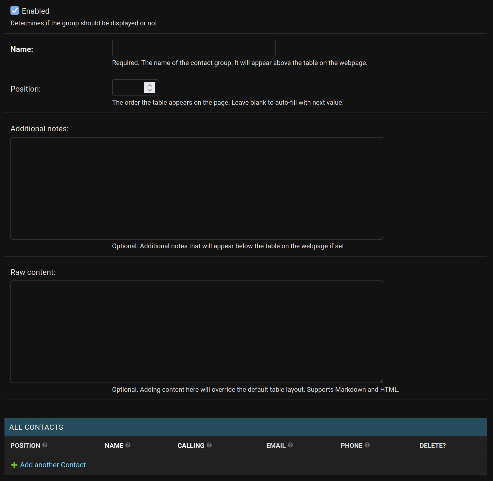

If you want to include a note attached to the footer of a table, you can add it in the **Additional notes** section.
- Our primary table includes the note: *If you need to set up an appointment with a member of the bishopric, talk to the Executive Secretary, or get set apart for a calling, you can visit the ward offices right after church.*

You might want a table for key ward contacts, and a second table for key stake contacts, facilities management, the full-time missionaries, and so on. 

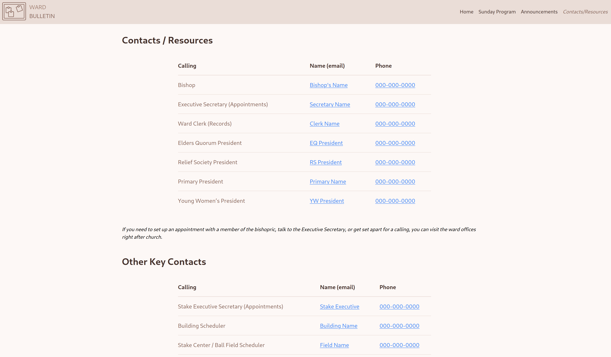

If the default table format doesn't work for what you want to display, you can use the **Raw content** field to include anything else you want on the page. It supports markdown (including markdown tables) and HTML like the [announcement](#announcements) entries. 

For example, our page includes an "Online Resources" table with links to the Church website and ward/stake facebook groups:

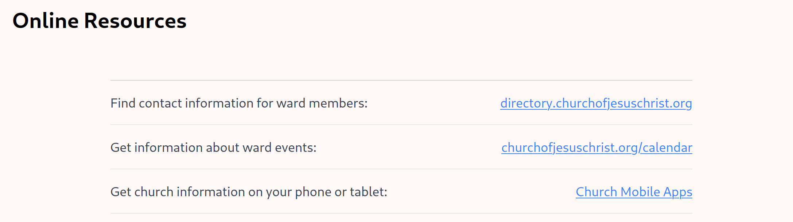

This table was created with markdown:

| | |
| :--- | ---: |
| Find contact information for ward members: | [directory.churchofjesuschrist.org](https://directory.churchofjesuschrist.org/) |
| Get information about ward events: | [churchofjesuschrist.org/calendar](https://www.churchofjesuschrist.org/calendar/) |
| Get church information on your phone or tablet: | [Church Mobile Apps](https://www.churchofjesuschrist.org/learn/mobile-applications?lang=eng) |

View this file's source if you want to see the source markdown for the table, or use a markdown editor to create a table.

  

---

  

If anthing is still unclear or missing from this document, please [create a discussion on github](https://github.com/DeeeeLAN/wardbulletin/discussions) and I will do my best to get this information updated, accurate, and clear.